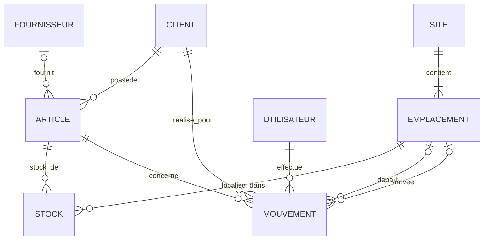

# MCD opérationnel — slide soutenance V4 officielle

> Version compacte 1-page pour la soutenance. Le MCD détaillé avec justifications est dans [`wms-mcd.md`](wms-mcd.md).

## V4 officielle — 8 entités

| Entité | Rôle |
|--------|------|
| `SITE` | Site physique NTL (Lille + WH1/WH2/WH3) |
| `EMPLACEMENT` | Emplacement de stockage dans un site |
| `ARTICLE` | Référence produit, appartient à un `CLIENT` |
| `FOURNISSEUR` | Référentiel global NTL des fournisseurs |
| `STOCK` | État courant unique par couple `(ARTICLE, EMPLACEMENT)` — entité réifiée dépendante |
| `MOUVEMENT` | Journal append-only horodaté, site dérivé via emplacement |
| `UTILISATEUR` | Opérateur ou admin WMS |
| `CLIENT` | Donneur d'ordre B2B propriétaire des articles |

## Pitch 30 secondes

1. **6 référentiels** : SITE, EMPLACEMENT, ARTICLE, CLIENT, FOURNISSEUR, UTILISATEUR.
2. **1 état courant** : STOCK = entité réifiée dépendante, une ligne unique par `(ARTICLE, EMPLACEMENT)`.
3. **1 journal** : MOUVEMENT = trace append-only horodatée. Site dérivé via `depart`/`arrivee`, dénormalisé pour TRANSFERT intra-site déclaratif.
4. **Multi-tenant double verrou** :
   - Au MCD : `realise_pour CLIENT-MOUVEMENT` rend la traçabilité visible.
   - Au MLD/DDL : FK composite `(id_article, id_client) REFERENCES articles(id_article, id_client)` (option D) verrouille la cohérence.

## Évolutions au-delà de V4

Évolutions hiérarchisées par valeur métier : lots/FEFO, cycle commande, code-barres, réservation stock, FOURNISSEUR scoped par client si besoin contractuel.
