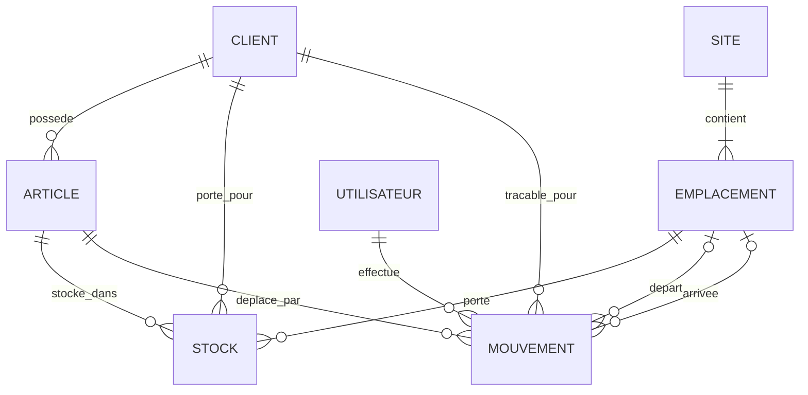

# MCD opérationnel — slide soutenance

> Version compacte 1-page pour la soutenance. Le MCD détaillé avec justifications est dans [`wms-mcd.md`](wms-mcd.md).

## V1 simplifiée — 7 entités

| Entité | Rôle |
|--------|------|
| `SITE` | Site physique NTL (Lille + WH1/WH2/WH3) |
| `EMPLACEMENT` | Emplacement de stockage dans un site |
| `ARTICLE` | Référence produit, appartient à un `CLIENT` |
| `STOCK` | État courant client × article × emplacement |
| `MOUVEMENT` | Journal append-only des opérations stock |
| `UTILISATEUR` | Opérateur ou admin WMS |
| `CLIENT` | Donneur d'ordre B2B propriétaire des articles |

## Pitch 30 secondes

1. **5 référentiels** : SITE, EMPLACEMENT, ARTICLE, CLIENT, UTILISATEUR.
2. **1 entité associative** : STOCK = état courant (ARTICLE × EMPLACEMENT) + quantité.
3. **1 journal** : MOUVEMENT = trace append-only, horodatée et rattachée au client.
4. **Séparation client à double chemin** : chaîne métier `CLIENT possede ARTICLE`, verrou d'intégrité direct `CLIENT porte_pour STOCK` / `tracable_pour MOUVEMENT` → FK composites `(id_article, id_client)` au MLD/DDL.

## Évolutions au-delà de la V1

Voir [`../ROADMAP.md`](../ROADMAP.md) — évolutions hiérarchisées par valeur métier (lots/FEFO, cycle commande, code-barres, réservation stock, fournisseurs entité).
