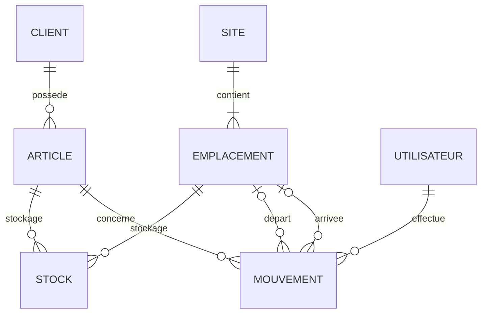

# MCD opérationnel — slide soutenance V3-GPT

> Version compacte 1-page pour la soutenance. Le MCD détaillé avec justifications est dans [`wms-mcd-v3-gpt.md`](wms-mcd-v3-gpt.md).

## V3-GPT — 7 entités

| Entité | Rôle |
|--------|------|
| `SITE` | Site physique NTL (Lille + WH1/WH2/WH3) |
| `EMPLACEMENT` | Emplacement de stockage dans un site |
| `ARTICLE` | Référence produit, appartient à un `CLIENT` |
| `STOCK` | État courant unique par article × emplacement |
| `MOUVEMENT` | Journal append-only horodaté, site dérivé via emplacement |
| `UTILISATEUR` | Opérateur ou admin WMS |
| `CLIENT` | Donneur d'ordre B2B propriétaire des articles |

## Pitch 30 secondes

1. **5 référentiels** : SITE, EMPLACEMENT, ARTICLE, CLIENT, UTILISATEUR.
2. **1 état courant** : STOCK = entité associative renforcée, une ligne unique par `(ARTICLE, EMPLACEMENT)`.
3. **1 journal** : MOUVEMENT = trace append-only, horodatée, site dérivé via `depart`/`arrivee`.
4. **Séparation client** : `ARTICLE (CODE_CLIENT, REFERENCE)` puis FK composite `(id_article, id_client)` au MLD/DDL.

## Évolutions au-delà de V3-GPT

Voir [`../ROADMAP.md`](../ROADMAP.md) — évolutions hiérarchisées par valeur métier (lots/FEFO, cycle commande, code-barres, réservation stock, fournisseurs entité).
